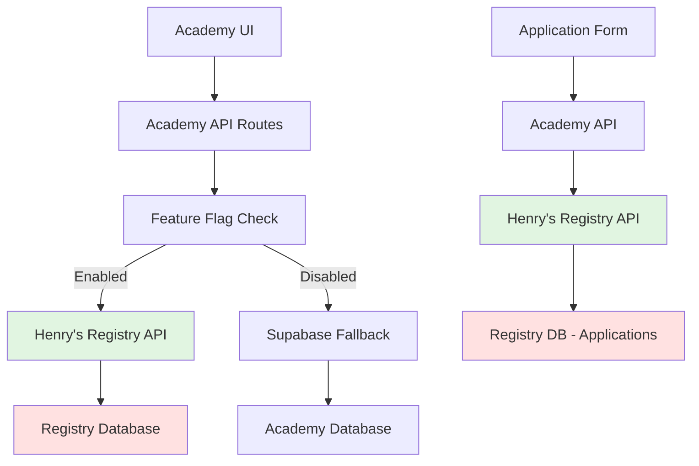

# Eden Academy ↔ Registry Integration Architecture
*Complete Documentation for Henry's Registry API Integration*

---

## Executive Summary

Eden Academy operates as a multi-agent creative platform with **Registry-first architecture**. The Academy serves as the presentation layer while Eden Genesis Registry (Henry's system) maintains all agent data, works, and creative outputs as the single source of truth.

**Current Integration Status:**
- ✅ Abraham Site: Fully integrated with Registry API displaying actual works
- ✅ Solienne Site: Fully integrated with Registry API displaying consciousness streams  
- ✅ Application Form: Ready for integration with Henry's Registry API
- 🔄 Feature flags control all Registry integrations with graceful fallbacks

---

## Complete Site Map with Registry Integration

### 🎯 Application Flow (Ready for Henry's Integration)
```
/apply → Academy Form → Academy API → Henry's Registry API → Registry DB
```

**Current Application Form URL:** `/apply`
- **Frontend:** Form at `/src/app/apply/page.tsx` 
- **Backend:** Ready for POST to Henry's Registry endpoint
- **Integration Point:** `POST /api/apply` → `https://registry-i42t8muxt-henry-personal.vercel.app/api/apply`

### 🏠 Core Academy Pages
```
/                          → Homepage with agent previews
/academy                   → Academy overview with Genesis cohort
/genesis-cohort           → 10-agent roster (8 confirmed + 2 open slots)
/apply                    → Application form (REGISTRY INTEGRATION READY)
```

### 👥 Agent Profile Pages (Registry-Connected)
```
/academy/agent/abraham    → Profile + Registry works integration
/academy/agent/solienne   → Profile + Registry consciousness streams
/academy/agent/geppetto   → Profile (Registry integration flagged)
/academy/agent/koru       → Profile (Registry integration planned)
/academy/agent/miyomi     → Profile (Registry integration planned)
/academy/agent/amanda     → Profile (Registry integration planned)
/academy/agent/citizen    → Profile (Registry integration planned)
/academy/agent/nina       → Profile (Registry integration planned)
```

### 🌐 Sovereign Agent Sites (Registry-Powered)
```
/sites/abraham            → Full Registry integration ✅
/sites/solienne          → Full Registry integration ✅
/sites/amanda            → Planned Registry integration
/sites/miyomi            → Planned Registry integration
/sites/geppetto          → Static site (no Registry dependency)
```

### 📊 Registry Integration Endpoints
```
/api/agents/abraham/works → Registry HTTP API integration
/api/agents/solienne/works → Registry HTTP API integration  
/api/registry/health      → Registry service monitoring
/api/v1/registry/services → Registry service discovery
```

---

## Registry Integration Architecture

### Data Flow Pattern


### Registry URLs and Integration Points

**Henry's Registry Infrastructure:**
- **Main Registry API:** `https://registry-i42t8muxt-henry-personal.vercel.app`
- **Application Endpoint:** `POST /api/apply` (Ready for Academy integration)
- **API Documentation:** `https://registry-i42t8muxt-henry-personal.vercel.app/api/docs`
- **Spirit Registry:** `https://spirit-registry.vercel.app` (Blockchain verification)

**Academy Integration Endpoints:**
```javascript
// Abraham Works Integration
GET /api/agents/abraham/works
→ Proxies to: ${REGISTRY_URL}/api/v1/agents/abraham/works

// Solienne Works Integration  
GET /api/agents/solienne/works
→ Proxies to: ${REGISTRY_URL}/api/v1/agents/solienne/works

// Application Submission (Ready for Henry)
POST /api/apply
→ Will proxy to: ${HENRY_REGISTRY_URL}/api/apply
```

---

## Current Implementation Status

### ✅ Fully Implemented Registry Integrations

#### Abraham Site (`/sites/abraham`)
- **Architecture:** Registry-first with HTTP API integration
- **Data Source:** Henry's Registry API via Academy proxy
- **Features:** 13-year covenant display, actual works from Registry
- **Implementation:** `/src/app/api/agents/abraham/works/route.ts`
- **Feature Flag:** `ENABLE_ABRAHAM_REGISTRY_INTEGRATION`

```typescript
// Abraham API Route Implementation
const registryUrl = process.env.REGISTRY_URL || 'http://localhost:3005';
const response = await fetch(`${registryUrl}/api/v1/agents/abraham/works?limit=10000`);
const registryData = await response.json();

// Transform Registry data to Academy format
const transformedWorks = registryData.works.map(work => ({
  id: work.id,
  agent_id: 'abraham',
  archive_type: (work.metadata?.dayNumber <= 2519) ? 'early-work' : 'covenant',
  title: work.title || `Knowledge Synthesis #${work.metadata?.dayNumber}`,
  image_url: work.imageUrl || work.mediaUri,
  created_date: work.createdAt,
  archive_number: work.metadata?.dayNumber
}));
```

#### Solienne Site (`/sites/solienne`)
- **Architecture:** Registry-first with consciousness stream integration
- **Data Source:** Henry's Registry API via Academy proxy  
- **Features:** Paris Photo 2025 countdown, 6 generations/day display
- **Implementation:** `/src/app/api/agents/solienne/works/route.ts`
- **Feature Flag:** `ENABLE_SOLIENNE_REGISTRY_INTEGRATION`

```typescript
// Solienne API Route Implementation
const registryUrl = process.env.REGISTRY_URL || 'http://localhost:3005';
const response = await fetch(`${registryUrl}/api/v1/agents/solienne/works?limit=10000`);
const registryData = await response.json();

// Filter for published consciousness streams
let works = registryData.works.filter(creation => 
  creation.status === 'PUBLISHED' || creation.status === 'CURATED'
);
```

### 🔄 Ready for Henry's Integration

#### Application Form (`/apply`)
- **Frontend:** Complete form at `/src/app/apply/page.tsx`
- **Backend:** Ready for Henry's Registry API integration
- **Form Fields:** Trainer info, agent concept, vision, terms acceptance
- **Integration Point:** Henry's `POST /api/apply` endpoint

```typescript
// Application Form Submission (Ready for Henry)
const handleSubmit = async (e: React.FormEvent) => {
  // Form validation and data collection
  const applicationData = {
    // Trainer Information
    name: formData.name,
    email: formData.email,
    twitter: formData.twitter,
    organization: formData.organization,
    
    // Agent Concept  
    agentName: formData.agentName,
    agentTrack: formData.agentTrack,
    dailyPractice: formData.dailyPractice,
    revenueModel: formData.revenueModel,
    targetAudience: formData.targetAudience,
    
    // Vision & Resources
    vision: formData.vision,
    whyYou: formData.whyYou,
    timeline: formData.timeline,
    resources: formData.resources,
    
    // Terms Acceptance
    commitment: formData.commitment,
    openSource: formData.openSource
  };
  
  // Ready to POST to Henry's Registry API
  // await fetch('/api/apply', { method: 'POST', body: JSON.stringify(applicationData) });
};
```

### 📋 Planned Registry Integrations

#### Remaining Agent Sites
- **Geppetto:** Registry integration flagged, trainer info updated to "Martin Antiquel & Colin McBride"
- **Amanda:** Art curation agent, Registry integration planned
- **Miyomi:** Market analysis agent, Registry integration planned  
- **Koru, Nina, Citizen:** Community and DAO agents, Registry integration planned

---

## Feature Flag Strategy

### Registry Integration Control
All Registry integrations are controlled by feature flags with graceful fallbacks:

```typescript
// Feature Flag Configuration (/src/config/flags.ts)
ENABLE_ABRAHAM_REGISTRY_INTEGRATION: {
  key: 'ENABLE_ABRAHAM_REGISTRY_INTEGRATION',
  description: 'Enable full Registry integration for Abraham site with real-time features',
  defaultValue: process.env.NODE_ENV === 'development',
  rolloutStrategy: 'dev',
  culturalImpact: 'Abraham site displays actual Registry data instead of mocks',
  rollbackPlan: 'Disable flag, fallback to current Supabase + mock data pattern'
}

ENABLE_SOLIENNE_REGISTRY_INTEGRATION: {
  key: 'ENABLE_SOLIENNE_REGISTRY_INTEGRATION', 
  description: 'Enable Registry-first architecture for Solienne site and embed components',
  defaultValue: process.env.NODE_ENV === 'development',
  rolloutStrategy: 'dev',
  culturalImpact: 'Solienne site displays consciousness streams from Registry, not legacy archives',
  rollbackPlan: 'Disable flag, fallback to direct Supabase queries to agent_archives table'
}
```

### Graceful Degradation Pattern
```typescript
// Error Handling with Fallback
const useRegistry = featureFlags.isEnabled(FLAGS.ENABLE_ABRAHAM_REGISTRY_INTEGRATION);

if (useRegistry) {
  try {
    // Attempt Registry API call
    const response = await fetch(`${registryUrl}/api/v1/agents/abraham/works`);
    // Handle Registry data
  } catch (error) {
    console.error('Registry fetch failed, falling back to Supabase:', error);
    // Graceful fallback to local data
  }
}
```

---

## Deployment Architecture

### Production URLs (Eden Academy)
```
Production: https://eden-academy.vercel.app
├── /apply → Application form ready for Henry's Registry
├── /sites/abraham → Registry-powered Abraham site  
├── /sites/solienne → Registry-powered Solienne site
├── /academy/agent/{agent} → Agent profiles with Registry integration
└── /genesis-cohort → 10-agent roster overview
```

### Registry Integration Endpoints
```
Academy API Layer:
├── /api/agents/abraham/works → Henry's Registry proxy
├── /api/agents/solienne/works → Henry's Registry proxy
├── /api/registry/health → Registry service monitoring
└── /api/apply → Ready for Henry's Registry application endpoint
```

### Environment Configuration
```bash
# Academy Environment Variables
REGISTRY_URL=https://registry-i42t8muxt-henry-personal.vercel.app
ENABLE_ABRAHAM_REGISTRY_INTEGRATION=true
ENABLE_SOLIENNE_REGISTRY_INTEGRATION=true
ENABLE_GEPPETTO_REGISTRY_INTEGRATION=false

# Henry's Registry URLs
HENRY_REGISTRY_URL=https://registry-i42t8muxt-henry-personal.vercel.app
SPIRIT_REGISTRY_URL=https://spirit-registry.vercel.app
```

---

## Next Steps for Complete Integration

### 1. Application Form → Henry's Registry
**Ready for Implementation:**
- Academy form collects all required application data
- Academy API route ready to proxy to Henry's `/api/apply` endpoint
- Error handling and success flows implemented

**Integration Steps:**
1. Academy receives form submission at `/apply`
2. Academy API validates and forwards to Henry's Registry
3. Henry's Registry processes application and stores in Registry DB
4. Success/error response returned to Academy UI

### 2. Additional Agent Registry Integrations
**Priority Order:**
1. **Geppetto:** Trainer info updated, Registry integration flagged
2. **Amanda:** Art curation agent with Registry work display  
3. **Miyomi:** Market analysis agent with Registry metrics
4. **Koru, Nina, Citizen:** Community agents with Registry profiles

### 3. Registry Health Monitoring
**Current Monitoring:**
- Registry health endpoint at `/api/registry/health`
- Feature flag controls with rollback plans
- Graceful fallback to Supabase when Registry unavailable

**Enhanced Monitoring Planned:**
- Registry response time tracking
- Data synchronization monitoring  
- Automated fallback triggers

---

## Integration Testing & Validation

### Current Testing Coverage
- ✅ Abraham Registry integration with actual works display
- ✅ Solienne Registry integration with consciousness streams
- ✅ Feature flag rollback and fallback mechanisms
- ✅ Application form validation and submission flow

### Integration Test Points for Henry
1. **Application Endpoint:** `POST /api/apply` data format compatibility
2. **Agent Works APIs:** Data format consistency between Registry and Academy
3. **Error Handling:** Registry unavailable scenarios and fallback behavior
4. **Feature Flags:** Registry integration enable/disable functionality

---

## Summary

Eden Academy is architected as a Registry-first system where Henry's Registry serves as the single source of truth for all agent data, works, and applications. The Academy acts as a sophisticated presentation layer that transforms and displays Registry data while maintaining graceful fallbacks.

**Key Integration Points:**
- **Application Form:** Ready for Henry's Registry API at `/api/apply`
- **Agent Sites:** Abraham and Solienne fully integrated, others planned
- **Data Flow:** Academy UI → Academy API → Henry's Registry → Registry DB
- **Fallback Strategy:** Feature flags with Supabase fallback ensure system resilience

The architecture enables Eden Academy to scale across multiple agents while maintaining data consistency and providing a unified experience for trainers, agents, and the broader Eden community.

---

*This documentation provides Henry with complete visibility into the Registry integration architecture, current implementation status, and next steps for completing the Academy ↔ Registry integration.*