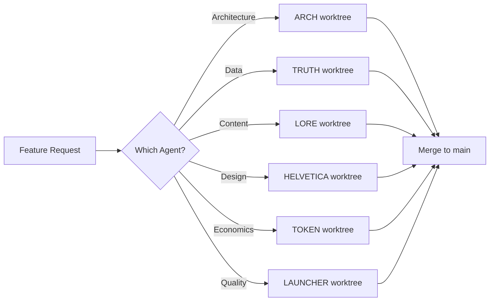

# ADR-018: Worktree-Agent Alignment for Claude Coding Agents

## Status
Accepted

## Context
Current worktree setup has 8 worktrees but only 6 Claude Coding Agents are defined:
- ARCH (Architecture Guardian)
- TRUTH (Registry/Data Guardian)
- LORE (Narrative Guardian)
- HELVETICA (Brand Guardian)
- TOKEN (Token Economist)
- LAUNCHER (Agent Launcher)

The mismatch causes:
- Resource waste (unused worktrees)
- Confusion about agent responsibilities
- Inconsistent development workflow
- Unclear ownership of features

## Decision

### 1. Worktree Structure Aligned with 6 Coding Agents

Each Claude Coding Agent gets exactly one worktree:

```
/Users/seth/eden-worktrees/
├── arch/           # ARCH - System Architecture
│   ├── Branch: feature/architecture
│   ├── Port: 3001
│   └── Focus: ADRs, system design, technical coherence
│
├── truth/          # TRUTH - Data Integrity
│   ├── Branch: feature/data-integrity
│   ├── Port: 3002
│   └── Focus: Registry integration, data models, single source of truth
│
├── lore/           # LORE - Narrative & Culture
│   ├── Branch: feature/narrative-culture
│   ├── Port: 3003
│   └── Focus: Language, naming, cultural mission, user-facing copy
│
├── helvetica/      # HELVETICA - Visual Design
│   ├── Branch: feature/visual-design
│   ├── Port: 3004
│   └── Focus: UI components, design system, brand consistency
│
├── token/          # TOKEN - Economics
│   ├── Branch: feature/token-economics
│   ├── Port: 3005
│   └── Focus: Revenue models, pricing, token distribution
│
└── launcher/       # LAUNCHER - Agent Quality
    ├── Branch: feature/agent-quality
    ├── Port: 3006
    └── Focus: Onboarding flows, launch criteria, quality gates
```

### 2. Deprecated Worktrees to Remove

These worktrees will be removed as their responsibilities are absorbed:
- `academy-domain` → Absorbed by LORE
- `feature-integrator` → Absorbed by ARCH
- `ui-design` → Renamed to HELVETICA
- `code-review` → Absorbed by ARCH
- `registry` → Renamed to TRUTH
- `architecture` → Renamed to ARCH
- `token-economics` → Renamed to TOKEN
- `agent-launcher` → Renamed to LAUNCHER

### 3. Agent Responsibility Matrix

| Agent | Primary Domain | Git Worktree | Port | Key Files |
|-------|---------------|--------------|------|-----------|
| ARCH | System Architecture | /arch | 3001 | ADRs, schemas, configs |
| TRUTH | Data Integrity | /truth | 3002 | Models, migrations, registry |
| LORE | Narrative/Culture | /lore | 3003 | Copy, content, docs |
| HELVETICA | Visual Design | /helvetica | 3004 | Components, styles, UI |
| TOKEN | Economics | /token | 3005 | Calculators, metrics, pricing |
| LAUNCHER | Agent Quality | /launcher | 3006 | Onboarding, validation, criteria |

### 4. Development Workflow



### 5. Worktree Commands

Setup new structure:
```bash
# Remove old worktrees
git worktree remove /Users/seth/eden-worktrees/academy-domain
git worktree remove /Users/seth/eden-worktrees/feature-integrator
git worktree remove /Users/seth/eden-worktrees/code-review
git worktree remove /Users/seth/eden-worktrees/architecture
git worktree remove /Users/seth/eden-worktrees/registry
git worktree remove /Users/seth/eden-worktrees/ui-design
git worktree remove /Users/seth/eden-worktrees/token-economics
git worktree remove /Users/seth/eden-worktrees/agent-launcher

# Create new aligned worktrees
git worktree add -b feature/architecture /Users/seth/eden-worktrees/arch
git worktree add -b feature/data-integrity /Users/seth/eden-worktrees/truth
git worktree add -b feature/narrative-culture /Users/seth/eden-worktrees/lore
git worktree add -b feature/visual-design /Users/seth/eden-worktrees/helvetica
git worktree add -b feature/token-economics /Users/seth/eden-worktrees/token
git worktree add -b feature/agent-quality /Users/seth/eden-worktrees/launcher
```

### 6. Shell Aliases

Add to `.zshrc` or `.bashrc`:
```bash
# Claude Coding Agent Worktree Navigation
alias arch='cd /Users/seth/eden-worktrees/arch'
alias truth='cd /Users/seth/eden-worktrees/truth'
alias lore='cd /Users/seth/eden-worktrees/lore'
alias helvetica='cd /Users/seth/eden-worktrees/helvetica'
alias token='cd /Users/seth/eden-worktrees/token'
alias launcher='cd /Users/seth/eden-worktrees/launcher'
alias main='cd /Users/seth/eden-academy'
```

## Consequences

### Positive
- Perfect 1:1 alignment between agents and worktrees
- Clear ownership and responsibility
- Reduced resource usage (6 instead of 8 worktrees)
- Intuitive navigation with agent names
- No ambiguity about where to make changes

### Negative
- Requires recreating all worktrees
- Need to update all documentation references
- Developers must learn new structure

### Neutral
- Each agent maintains independence
- Parallel development continues
- Port allocation simplified

## Implementation Plan

1. **Phase 1**: Archive work in existing worktrees
2. **Phase 2**: Remove old worktree structure
3. **Phase 3**: Create new 6-agent aligned worktrees
4. **Phase 4**: Update documentation and scripts
5. **Phase 5**: Configure shell aliases

## Related ADRs
- ADR-016: Service Boundary Definition
- ADR-017: Documentation Hierarchy
- ADR-019: Registry Integration Pattern

## References
- Agent Cheatsheet: /admin/docs/coding-agents/cheatsheet.md
- Worktree Setup Script: /setup-worktrees.sh