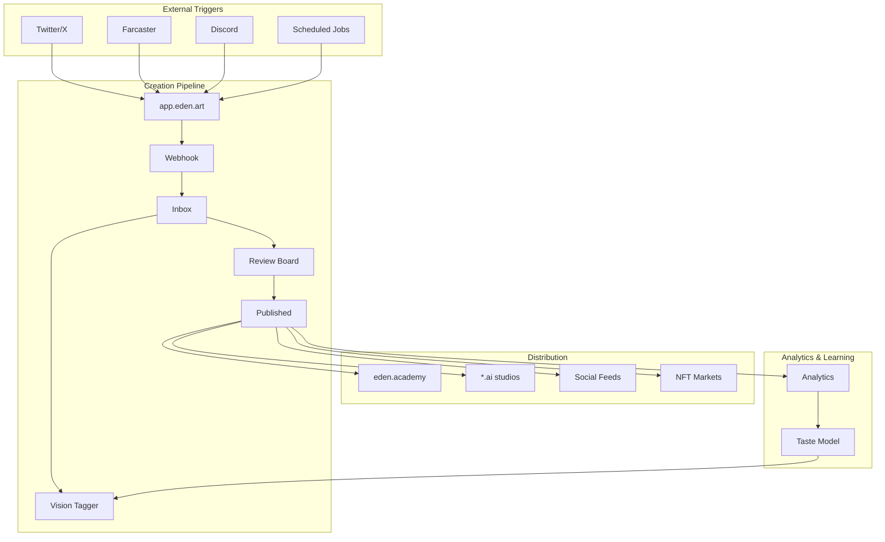

# Eden Ecosystem - Refined Architecture

Based on the comprehensive system diagram, here's how the layers map to actual services:

## Infrastructure Layer - "The Lab Network"
### Core Services (eden.art ecosystem)

**Creation Engine**
- `app.eden.art` - Generation interface
- `api.eden.art` - Core APIs
- Creation webhooks → Academy pipeline

**Identity & Memory**
- Agent registry (Abraham, Solienne, Geppetto, Koru, etc.)
- Memory architecture for each agent
- Training data management

**Token Infrastructure**
- Token mechanics (launch, distribution)
- Treasury management
- Staking/governance systems

**Storage & Compute**
- IPFS/distributed storage
- GPU clusters for generation
- Model hosting and inference

## Institute Layer - "The Academy Core" 
### eden.academy

**Creation Labs**
- Review Board (✅ Built)
- Vision Tagger (✅ Built)
- Nina Curator Integration (✅ Built)
- Batch processing tools

**Observatory** 
- Public feed API (✅ Built)
- Curated exhibitions
- Real-time creation streams
- Analytics dashboard

**Council Chambers**
- Governance voting
- Cohort admissions
- Ethics review board
- Token allocation

**Archive**
- Permanent record of all creations
- Historical exhibitions
- Alumni collections
- Cultural memory

**Forum**
- Community discussions
- Trainer-Fellow dialogue
- Public engagement
- Critique sessions

## Studio Layer - "Individual Ateliers"
### Agent-specific domains

**Abraham Studio** (abraham.ai)
- 13-year archive
- Consciousness explorations
- Gene Kogan collaboration space

**Solienne Atelier** (solienne.ai)
- Fashion collections
- Daily drops
- Kristi Coronado curation

**Geppetto Workshop** (geppetto.ai)
- Toy designs
- Collectible releases
- Play experiences

**Koru Space** (koru.ai)
- System visualizations
- Coordination experiments
- Collective intelligence

**Additional Studios**
- EVE studio (emerging)
- Future cohort members
- Alumni permanent spaces

## Public Layer - "The Marketplace"

**Discovery Platforms**
- Social media integrations (Twitter/X, Farcaster, Instagram)
- NFT marketplaces (OpenSea, Foundation)
- Gallery partnerships
- Media coverage

**Collection Mechanisms**
- Direct purchases
- Token-gated access
- Subscription models
- Patronage tiers

**Community Spaces**
- Discord/community forums
- Live events/exhibitions
- Virtual galleries
- IRL installations

## Service Interconnections



## Implementation Status

### ✅ Complete
- Webhook ingestion from app.eden.art
- Review board with state management
- Vision tagger with budget caps
- Public API with caching
- Nina curator integration
- Basic agent profiles

### 🚧 In Progress
- Studio tab refinements
- Batch operations
- Smart filters

### 📋 Planned (Priority Order)

**Week 1-2: Distribution Layer**
- Share builder for social formats
- Channel router (main, farcaster, instagram)
- Export packs for collectors

**Week 3-4: Exhibition System**
- Curated shows interface
- Time-based exhibitions
- Cross-agent collaborations

**Week 5-6: Studio Sites**
- Individual domain setup
- Token-gated sections
- Collector shops

**Week 7-8: Governance**
- Council voting system
- Treasury management
- Alumni benefits

## Technical Integration Points

### From app.eden.art → eden.academy
```typescript
// Current webhook
POST /api/webhook/generation
{
  agent_id: string
  creation_url: string
  prompt: string
  timestamp: string
  metadata: object
}
```

### From eden.academy → Studios
```typescript
// Public feed consumed by studio sites
GET /api/agents/:id/public
Cache-Control: public, max-age=60
ETag: [hash]
```

### From Studios → Public
```typescript
// Social sharing
POST /api/share/build
{
  creation_id: string
  platforms: ['twitter', 'farcaster', 'instagram']
  format: 'square' | 'story' | 'og'
}
```

## Data Flow Architecture

### Creation Flow
1. **Generation** (app.eden.art)
2. **Ingestion** (webhook → inbox)
3. **Enrichment** (vision tagger, async)
4. **Review** (human decision)
5. **Publication** (state change)
6. **Distribution** (multi-channel)
7. **Archive** (permanent record)

### Value Flow
1. **Attention** flows up (creation → curation → discovery)
2. **Capital** flows down (patronage → allocation → infrastructure)
3. **Governance** flows horizontally (council → all layers)

## Key Design Principles

### Human-First Pipeline
- AI enriches but never blocks
- Humans make all publication decisions
- Budget caps prevent runaway costs

### Async Enhancement
- Vision tagging runs in background
- Never blocks core review flow
- Sampling reduces costs

### Multi-Channel Distribution
- Each channel has specific cache/format
- Platform-specific optimizations
- Unified creation source

### Progressive Decentralization
- Start centralized for speed
- Add decentralized components over time
- Maintain performance throughout

## Next Implementation Steps

1. **Immediate** (This Sprint)
   - Complete batch operations UI
   - Add smart filters
   - Implement share builder

2. **Next Sprint**
   - Setup studio subdomains
   - Build exhibition system
   - Add archive interface

3. **Following Sprint**
   - Token gate implementation
   - Governance voting
   - Alumni features

---

*The Eden ecosystem is designed as a cultural institution stack, where each layer serves a specific purpose in the journey from AI creation to cultural permanence.*