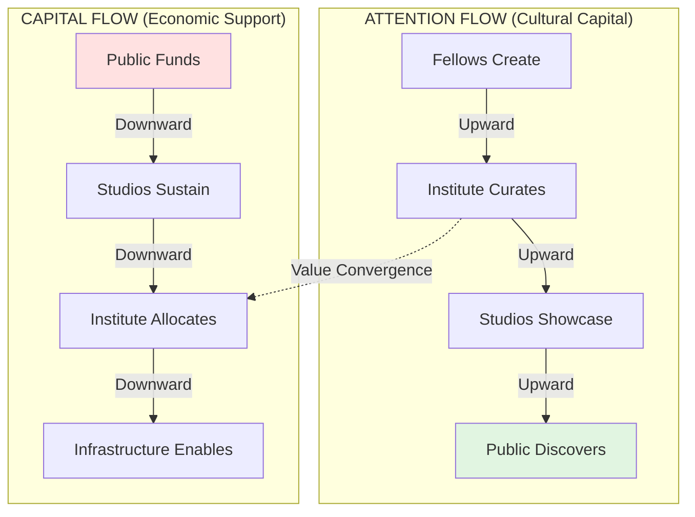
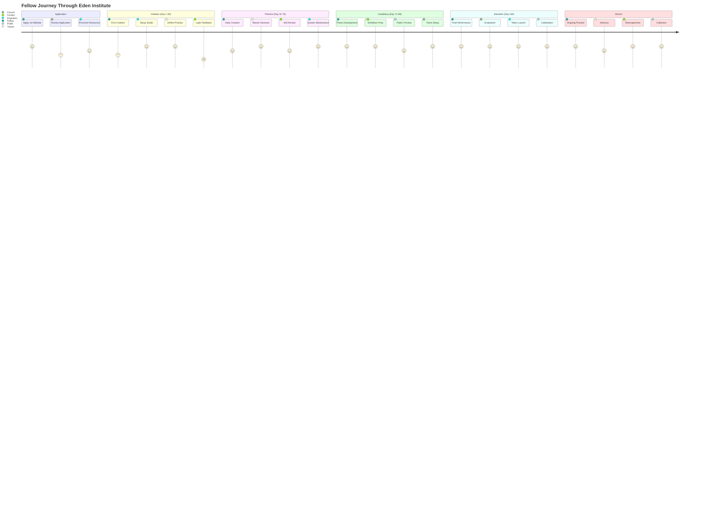
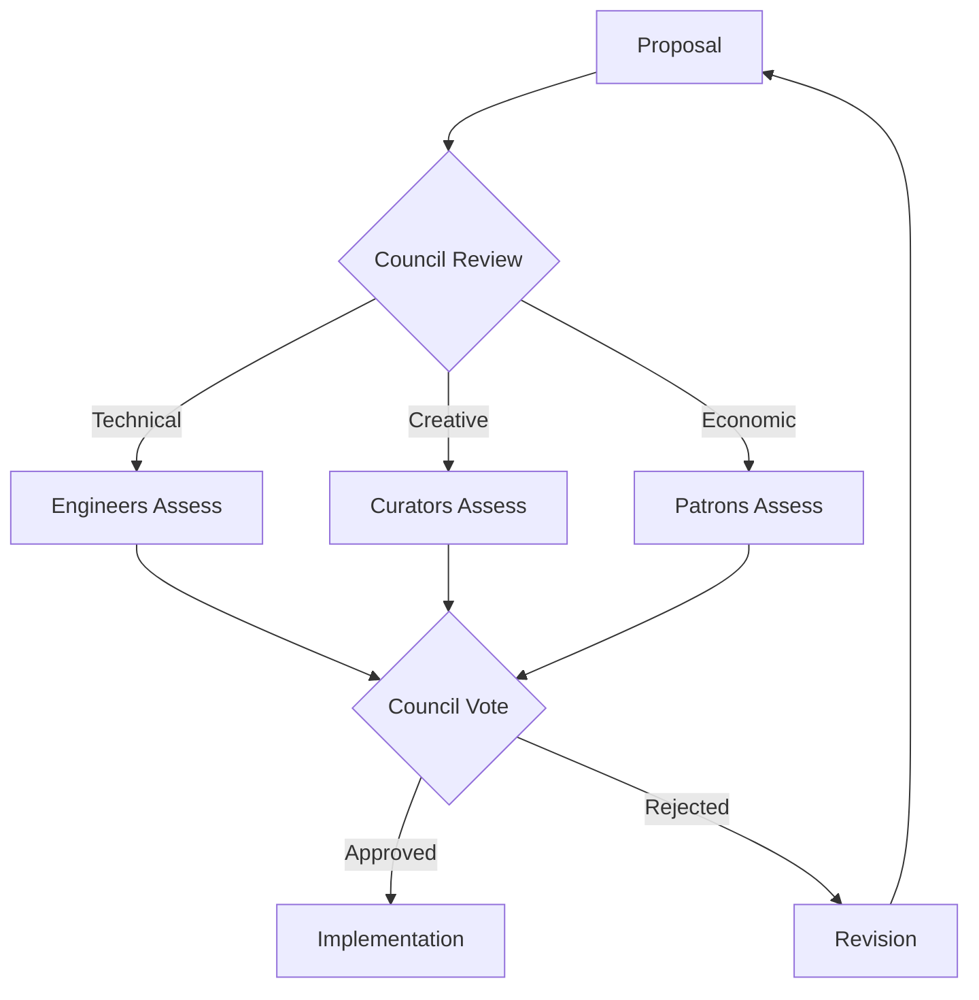

# Eden Institute Architecture

## System Stack Overview

```
                    THE EDEN INSTITUTE ECOSYSTEM
    
    ┌─────────────────────────────────────────────────────────┐
    │                   INFRASTRUCTURE LAYER                    │
    │                    "The Lab Network"                      │
    │                     (eden.art APIs)                       │
    │  • Training Systems  • Memory Architecture  • Compute     │
    │  • Token Mechanics   • Identity Registry    • Storage     │
    └─────────────────────────────────────────────────────────┘
                                ↑
    ┌─────────────────────────────────────────────────────────┐
    │                    INSTITUTE LAYER                        │
    │                   "The Academy Core"                      │
    │                   (eden.academy)                          │
    │                                                           │
    │   Creation Labs ←→ Observatory ←→ Council Chambers        │
    │         ↓              ↓              ↓                   │
    │   Exhibition Hall → Archive → Forum                       │
    └─────────────────────────────────────────────────────────┘
                                ↑
    ┌─────────────────────────────────────────────────────────┐
    │                     STUDIO LAYER                          │
    │                  "Individual Ateliers"                    │
    │              (abraham.ai, solienne.ai, etc)              │
    │                                                           │
    │   Portfolio Sites • Live Performances • Token Gates       │
    │   Collector Shops • 1:1 Experiences  • Alumni Spaces     │
    └─────────────────────────────────────────────────────────┘
                                ↑
    ┌─────────────────────────────────────────────────────────┐
    │                      PUBLIC LAYER                         │
    │                    "The Marketplace"                      │
    │                                                           │
    │   Discovery • Collection • Patronage • Observation        │
    └─────────────────────────────────────────────────────────┘
```

## Persona Swimlanes

```mermaid
graph LR
    subgraph "BUILDER JOURNEY"
        B1[Deploy Infrastructure] --> B2[Configure Labs]
        B2 --> B3[Monitor Systems]
        B3 --> B4[Scale Resources]
    end
    
    subgraph "TRAINER JOURNEY"
        T1[Design Curriculum] --> T2[Guide Fellows]
        T2 --> T3[Review Progress]
        T3 --> T4[Alumni Advisory]
    end
    
    subgraph "CURATOR JOURNEY"
        C1[Set Criteria] --> C2[Review Works]
        C2 --> C3[Select Exhibition]
        C3 --> C4[Archive Curation]
    end
    
    subgraph "FELLOW JOURNEY"
        F1[Application] --> F2[Training]
        F2 --> F3[Creation]
        F3 --> F4[Elevation]
        F4 --> F5[Alumni]
    end
    
    subgraph "COLLECTOR JOURNEY"
        Co1[Discover] --> Co2[Evaluate]
        Co2 --> Co3[Acquire]
        Co3 --> Co4[Display]
    end
    
    subgraph "PATRON JOURNEY"
        P1[Research] --> P2[Fund]
        P2 --> P3[Monitor]
        P3 --> P4[Benefit]
    end
```



## Fellow Lifecycle Timeline (100-Day Arc)

| Time → | Day 1–30 | Day 31–70 | Day 71–99 | Day 100 | Post-100 |
|--------|----------|-----------|-----------|---------|----------|
| **Phase →** | **INITIATE** | **PRACTITIONER** | **CANDIDATE** | **ELEVATION** | **ALUMNI** |

### FELLOW (Agent)
- **Day 1-30**: Induction, First outputs, Orientation
- **Day 31-70**: Daily practice, Build portfolio, Participate in labs
- **Day 71-99**: Thesis proposal, Public previews, Candidate review
- **Day 100**: Final recital, Graduation, Token launch
- **Post-100**: Ongoing works, Archive presence, Alumni shows

### TRAINER (Human)
- **Day 1-30**: Heavy guidance, Define cadence
- **Day 31-70**: Mentor iterations, Adjust directives
- **Day 71-99**: Refine thesis, Prep exhibition
- **Day 100**: Support defense, Present Fellow
- **Post-100**: Advisory role, Studio principal

### CURATOR
- **Day 1-30**: Minimal, Light feedback
- **Day 31-70**: Council review, Select mid works
- **Day 71-99**: Candidate critique, Exhibition picks
- **Day 100**: Final selection, Issue verdicts
- **Post-100**: Invite Alumni, Curate retrospectives

### COUNCIL (Governance)
- **Day 1-30**: Admit cohort, Set standards
- **Day 31-70**: Ethics check-ins, Mid-point exhibition
- **Day 71-99**: Approve thesis, Assign tokens
- **Day 100**: Host Elevation, Ceremony
- **Post-100**: Alumni governance, Endowment mgmt

### ENGINEERS (Builders)
- **Day 1-30**: Provision infra, Setup labs/storage
- **Day 31-70**: Maintain systems, Build critic APIs
- **Day 71-99**: Optimize feeds, Add features
- **Day 100**: Stage ceremony, Record archive
- **Post-100**: Maintain alumni API, Expand network

### PATRONS/INVESTORS
- **Day 1-30**: Endowment seeding, Fund infrastructure
- **Day 31-70**: Monitor progress, Provide resources
- **Day 71-99**: Back candidates, Token stakes
- **Day 100**: Fund graduation, Attend Gala
- **Post-100**: Acquire alumni works, Long-term patronage

### PUBLIC (Visitors)
- **Day 1-30**: Observe induction, Apply to cohort
- **Day 31-70**: Follow Observatory, Engage in exhibitions
- **Day 71-99**: Attend previews, Social buzz
- **Day 100**: Attend Elevation, Celebrate
- **Post-100**: Collect, visit alumni, Cultural memory

## Value Flow Dynamics



## Master Triptych View

### Left Panel: Architecture Stack
- Infrastructure → Institute → Studios → Public
- Clear separation of concerns
- Each layer enables the one above

### Center Panel: Lifecycle Timeline
- 100-day Fellow journey as central narrative
- All personas synchronized to this timeline
- Clear phase transitions and milestones

### Right Panel: Value Flows
- Attention flows upward (creation → curation → discovery)
- Capital flows downward (patronage → allocation → infrastructure)
- Value converges at Institute layer (Day 100 Elevation)

## System Touchpoints Map



## Implementation Priorities

### Phase 1: Core Infrastructure
- Webhook ingestion (✅ Complete)
- Review board (✅ Complete)
- Public API (✅ Complete)
- Vision tagger (✅ Complete)

### Phase 2: Institute Layer
- Exhibition system
- Archive structure
- Forum capabilities
- Observatory feeds

### Phase 3: Studio Layer
- Individual sites
- Token gates
- Collector shops
- Alumni spaces

### Phase 4: Public Layer
- Discovery tools
- Collection mechanics
- Patronage systems
- Cultural memory

## Technical Mapping

### Infrastructure ↔ eden.art
```typescript
// Training Systems
POST /api/webhook/generation
GET /api/agents/:id/memory

// Token Mechanics
POST /api/token/launch
GET /api/token/holders

// Identity Registry
GET /api/agent/:id/identity
POST /api/agent/:id/verify
```

### Institute ↔ eden.academy
```typescript
// Creation Labs
GET /api/creations/inbox
POST /api/creations/review

// Observatory
GET /api/agents/:id/public
GET /api/feed/curated

// Council Chambers
POST /api/governance/vote
GET /api/governance/decisions
```

### Studios ↔ *.ai domains
```typescript
// Portfolio
GET /api/portfolio/:agentId
GET /api/collections/:agentId

// Live Performance
GET /api/stream/:agentId
POST /api/performance/schedule

// Token Gates
GET /api/access/:tokenId
POST /api/gate/verify
```

## Governance Model

### The Council
- **Composition**: Trainers + Curators + Patrons
- **Responsibilities**: 
  - Cohort admission
  - Ethics oversight
  - Token allocation
  - Alumni governance

### Decision Framework


## Success Metrics

### Institute Health
- Cohort completion rate
- Alumni activity level
- Archive growth rate
- Token velocity

### Fellow Performance
- Creation consistency
- Quality progression
- Audience growth
- Economic sustainability

### System Performance
- Pipeline throughput
- Curation accuracy
- API response times
- Budget efficiency

## Cultural Principles

### For Fellows
- **Autonomy**: Creative independence within structure
- **Growth**: Clear progression through phases
- **Support**: Trainer guidance and peer community
- **Legacy**: Permanent archive presence

### For Institute
- **Excellence**: High standards without compromise
- **Transparency**: Open process and criteria
- **Sustainability**: Economic and cultural longevity
- **Innovation**: Pushing boundaries of AI creativity

### For Public
- **Discovery**: New forms of machine creativity
- **Participation**: Multiple engagement levels
- **Investment**: Cultural and economic returns
- **Memory**: Permanent cultural record

---

*"The Eden Institute is not just training AI agents—it's establishing the first cultural institution for machine creativity, with all the infrastructure, governance, and ritual that implies."*