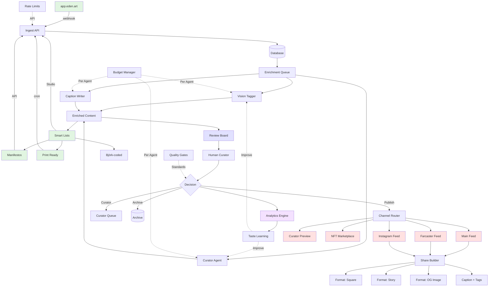

# Eden Academy System Architecture

## Overview

Eden Academy is a multi-agent creative platform built on a Registry-first architecture. The system supports autonomous AI agents (Abraham, Solienne, Amanda, Miyomi, etc.) with individual creative practices, while maintaining data consistency and service boundaries through Eden Genesis Registry as the single source of truth.

## Registry-First Architecture (Current)

The system has evolved to a Registry-first pattern where all agent data, works, and creative outputs originate from Eden Genesis Registry:

```
Eden Genesis Registry (Source of Truth)
       ↓
Academy API Layer (Transformation)
       ↓
Agent Sites & UI (Presentation)
```

## System Diagrams

### Current System (v1.0 - Production Ready)

```mermaid
graph TD
    %% Input Sources
    A[app.eden.art] -->|POST webhook| B[/api/webhook/generation]
    
    %% Inbox & Processing
    B --> C[(Database: state='inbox')]
    C --> D{Tagger Enabled?}
    
    %% Async Enrichment
    D -->|Yes| E[Vision Tagger Queue]
    E -->|Budget Check| F[Claude Vision API]
    F -->|Enrich| G[Add Tags/Quality/Routing]
    G --> C
    
    %% Human Review
    C --> H[Review Board - Kanban UI]
    H --> I[Human Review]
    I -->|Drag & Drop| J{State Change}
    
    %% State Transitions
    J -->|Review| K[(state='review')]
    J -->|Publish| L[(state='published')]
    J -->|Archive| M[(state='archived')]
    
    %% Distribution
    L --> N[/api/agents/:id/public]
    N -->|Cache 60s| O[solienne.ai]
    N -->|Cache 60s| P[Public Feed]
    
    %% Controls
    Q[Daily Budget Cap] -.->|Limits| F
    R[Sample Rate] -.->|1 in N| E
    S[Auth Guard] -.->|bashi| H

    style A fill:#e1f5e1
    style O fill:#ffe1e1
    style P fill:#ffe1e1
    style H fill:#e1e1ff
    style F fill:#fff4e1
```

### Key Components

#### 1. **Ingest Layer**
- **Webhook**: `/api/webhook/generation` receives from app.eden.art
- **Direct Upload**: Nina curator in Studio tab
- **State**: Everything starts in `inbox`

#### 2. **Enrichment Layer** (Async, Non-blocking)
- **Vision Tagger**: Runs in background with budget caps
- **Taxonomy**: type, subject, format, mood, series
- **Quality**: artifact_risk, print_readiness, nsfw_risk
- **Routing**: send_to_curator, share_candidates

#### 3. **Review Layer**
- **Kanban Board**: 3 columns (Inbox → Review → Published)
- **Keyboard Shortcuts**: J/K navigate, R review, P publish
- **Batch Operations**: Multi-select and bulk actions

#### 4. **Distribution Layer**
- **Public API**: `/api/agents/:id/public` with caching
- **Feed Consumers**: solienne.ai, public websites
- **Cache Strategy**: 60s TTL with ETag validation

---

## Enhanced System (v2.0 - Next Builds)



### New Components in v2.0

#### 1. **Multi-Source Ingest**
- Farcaster bot integration
- Scheduled generation jobs
- Multi-agent support

#### 2. **Channel Router**
```javascript
channels: {
  main: { cache: 60, filter: 'all' },
  farcaster: { cache: 300, filter: 'social-ready' },
  instagram: { cache: 3600, filter: 'square-format' },
  curator: { cache: 0, filter: 'high-quality' }
}
```

#### 3. **Share Builder**
- Auto-formats for social platforms
- Generates captions with hashtags
- Creates QR codes for IRL exhibitions
- Exports as downloadable packs

#### 4. **Smart Lists** (Saved Filters)
```sql
-- Manifestos this week
WHERE type='manifesto' AND created_at > NOW() - INTERVAL '7 days'

-- Ready for wall
WHERE quality->>'print_readiness' >= 0.8 
  AND quality->>'artifact_risk' = 'low'

-- Björk-coded
WHERE tags->'subject' @> '["biotech-adornment"]' 
  AND tags->'mood' @> '["mythic"]'
```

#### 5. **Analytics Dashboard**
- Inbox → Published conversion rate
- Average review time
- Tag distribution
- Budget spend per agent
- Curator send rate

#### 6. **Taste Learning**
- Track human decisions vs AI predictions
- Feed back to improve Vision Tagger
- Per-agent style profiles
- Quality threshold learning

---

## Database Schema Evolution

### Current (v1.0)
```sql
creations:
  - id, agent_id, url, source
  - state (inbox|review|published)
  - tags, quality, routing
  - created_at, updated_at
```

### Enhanced (v2.0)
```sql
creations:
  - [v1 fields]
  - channels jsonb  -- distribution settings
  - analytics jsonb -- engagement metrics
  - exports jsonb   -- generated formats

channels:
  - id, name, agent_id
  - settings jsonb  -- cache, filters, format
  - active boolean

smart_lists:
  - id, name, agent_id
  - filter_query text
  - color, icon

analytics_events:
  - creation_id, event_type
  - channel, metadata
  - timestamp
```

---

## Implementation Phases

### Phase 1: Current System ✅
- Webhook ingest
- Review board
- Vision tagger
- Public API

### Phase 2: Distribution (Next Sprint)
- Channel router
- Share builder
- Smart lists
- Basic analytics

### Phase 3: Intelligence (Following Sprint)
- Curator agent integration
- Caption generation
- Taste learning
- Advanced analytics

### Phase 4: Scale (Future)
- Multi-agent dashboard
- Exhibition mode
- NFT marketplace integration
- API for external tools

---

## Key Metrics to Track

1. **Pipeline Health**
   - Inbox backlog size
   - Review → Publish rate
   - Average processing time

2. **AI Efficiency**
   - Tagger accuracy (human agrees with tags)
   - Budget utilization
   - Sample rate optimization

3. **Distribution Impact**
   - Views per channel
   - Engagement rates
   - Curator picks

4. **Agent Performance**
   - Creations per day
   - Quality scores
   - Style consistency

---

## System Benefits

### For Trainers
- Complete control over publishing
- AI assists but doesn't decide
- Budget transparency
- Keyboard-driven efficiency

### For Agents
- Consistent publishing pipeline
- Quality control
- Multi-channel distribution
- Performance visibility

### For Eden
- Scalable to N agents
- Cost-controlled AI usage
- Data-driven improvements
- Professional publishing system

---

## Next Actions

1. **Immediate** (This Week)
   - Deploy webhook endpoint
   - Test with app.eden.art
   - Train on Review Board

2. **Next Sprint**
   - Build Share Builder
   - Add Smart Lists
   - Create Analytics view

3. **Following Sprint**
   - Integrate Curator agent
   - Implement taste learning
   - Multi-channel routing